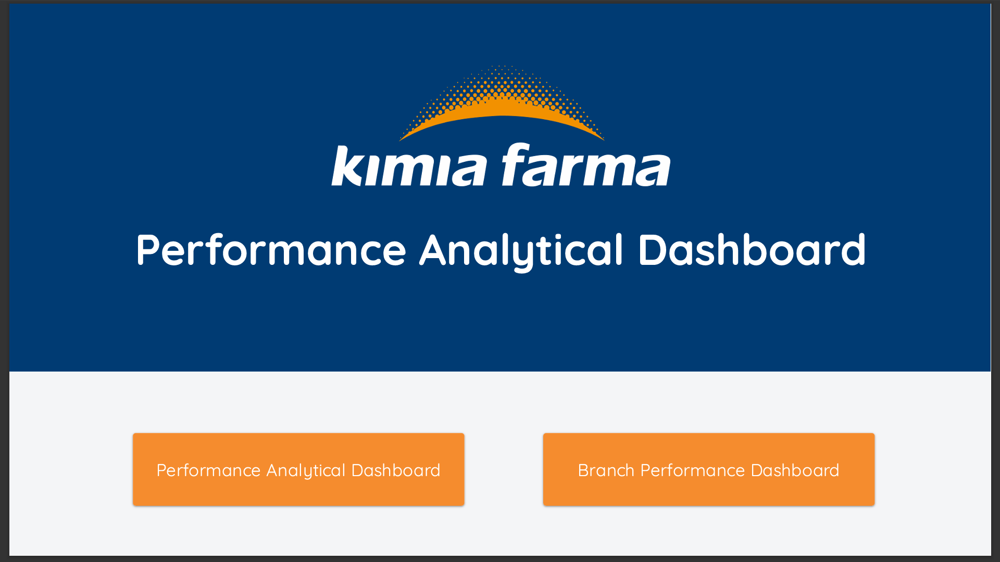
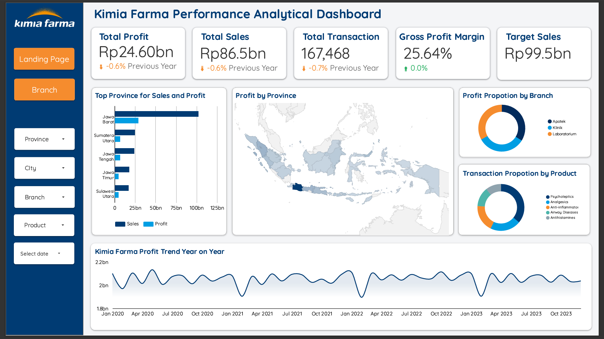
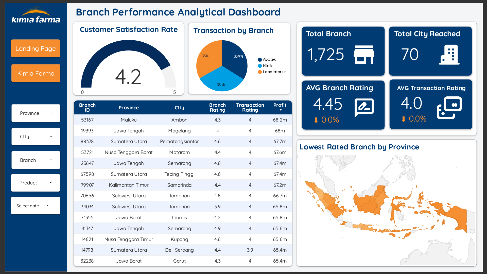

# 📊 Kimia Farma Performance Analytics Dashboard

*(Catatan: Ganti 'assets/dashboard_preview.png' dengan path screenshot dashboard utama kamu)*

## 📖 Overview
Proyek ini adalah dashboard analitik untuk mengevaluasi kinerja penjualan Kimia Farma. Dashboard ini dirancang untuk memantau Key Performance Indicators (KPI) utama seperti total penjualan, pencapaian target, dan kepuasan pelanggan di berbagai cabang.

Tujuannya adalah memberikan wawasan berbasis data kepada manajemen untuk mendukung pengambilan keputusan strategis terkait operasional cabang.

🔗 **[Lihat Live Dashboard di Sini](https://lookerstudio.google.com/reporting/abcbf5ec-72f5-4a48-a5d3-46fa3142214e)**

---

## 💼 Business Problem & Goals
Kimia Farma membutuhkan cara yang efisien untuk memantau performa cabang secara *real-time*. Tantangan utamanya adalah menyatukan data transaksi yang besar untuk menjawab pertanyaan bisnis seperti:
* Cabang mana yang mencapai target penjualan?
* Bagaimana tren kepuasan pelanggan (Customer Satisfaction) di setiap provinsi?
* Produk apa yang memiliki kontribusi profit terbesar?

**Solusi:**
Membangun dashboard interaktif menggunakan **Looker Studio** yang terhubung dengan data warehouse di **BigQuery** untuk visualisasi performa yang komprehensif.

---

## 🛠️ Tech Stack
* **Data Visualization:** Google Looker Studio
* **Data Source:** Google BigQuery
* **Data Processing:** SQL (Calculated Fields & Data Blending)

---

## 📂 Project Documentation
Untuk detail teknis mengenai data yang digunakan, silakan lihat dokumentasi berikut di dalam folder `docs/`:

1.  **[Data Dictionary](docs/data_dictionary.md)**: Penjelasan lengkap mengenai setiap kolom dalam dataset mentah (Raw Data).
2.  **[Calculated Fields](docs/calculated_fields.md)**: Dokumentasi logika dan rumus kustom yang dibuat di Looker Studio (seperti *Customer Satisfaction Score* & *Target Sales*).

---

## 📈 Key Insights & Metrics
Dashboard ini menyajikan metrik kunci sebagai berikut:

* **Sales vs Target:** Membandingkan total penjualan aktual dengan target dinamis (115% dari sales).
* **Customer Satisfaction Index:** Menggabungkan rating cabang dan rating transaksi untuk mendapatkan skor kepuasan yang holistik.
* **Branch Performance:** Peringkat cabang berdasarkan total revenue dan rating pelayanan.
* **Top Products:** Analisis produk dengan performa penjualan terbaik.

---

## 📷 Gallery

| Sales Overview | Branch Performance |
| :---: | :---: |
|  |  |

---

## 👤 Author
**Imtiyaz Shaffal Afif**
* Data Enthusiast | Looker Studio & SQL
* [LinkedIn](linkedin.com/in/imtiyazsa) | [Email](mailto:imtiyazshafhal.a@gmail.com)

---
*Disclaimer: Dataset ini digunakan untuk tujuan simulasi proyek data analytics.*
